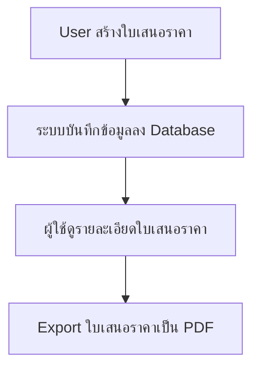

# Quotation Management System (ระบบจัดการใบเสนอราคา)

Web application สำหรับจัดการใบเสนอราคา พัฒนาด้วย Node.js, Express.js และ SQLite

## Features

- ✅ สร้างใบเสนอราคา (Create Quotation)
- ✅ ดูรายการใบเสนอราคาทั้งหมด (List Quotations)
- ✅ ดูรายละเอียดใบเสนอราคา (View Quotation Details)
- ✅ Export ใบเสนอราคาเป็น PDF (Export to PDF)
- ✅ ลบใบเสนอราคา (Delete Quotation)

## Project Structure

```
web/
├── index.js                    # Main Express app entry point
├── db.js                       # SQLite database setup & helpers
├── package.json                # Dependencies & scripts
├── routes/
│   └── quotations.js           # Quotation routes (CRUD + PDF)
├── services/
│   └── pdfGenerator.js         # PDF generation service
└── views/
    └── quotations/
        ├── index.ejs           # List all quotations
        ├── new.ejs             # Create new quotation form
        └── show.ejs            # View quotation details
```

## Technologies

| Technology | Purpose |
|------------|---------|
| Node.js | Runtime |
| Express.js | Web framework |
| SQLite | Database |
| EJS | Template engine |
| PDFKit | PDF generation |

## Installation

```bash
cd web
npm install
```

## Running the Application

```bash
# Production
npm start

# Development (with watch mode)
npm run dev
```

Server จะรันที่ http://localhost:3000

## API Routes

| Method | Route | Description |
|--------|-------|-------------|
| GET | `/quotations` | List all quotations |
| GET | `/quotations/new` | Create quotation form |
| POST | `/quotations` | Save new quotation |
| GET | `/quotations/:id` | View quotation details |
| GET | `/quotations/:id/pdf` | Download PDF |
| DELETE | `/quotations/:id` | Delete quotation |

## Database Schema

### quotations
| Column | Type | Description |
|--------|------|-------------|
| id | INTEGER | Primary key |
| volume_no | TEXT | เล่มที่ |
| document_no | TEXT | เลขที่เอกสาร |
| date | TEXT | วันที่ |
| seller_name | TEXT | ชื่อผู้ขาย |
| seller_address | TEXT | ที่อยู่ผู้ขาย |
| customer_name | TEXT | ชื่อลูกค้า |
| customer_address | TEXT | ที่อยู่ลูกค้า |
| total_amount | REAL | ยอดรวม |
| amount_in_words | TEXT | จำนวนเงินเป็นตัวอักษร |
| created_at | DATETIME | วันที่สร้าง |

### quotation_items
| Column | Type | Description |
|--------|------|-------------|
| id | INTEGER | Primary key |
| quotation_id | INTEGER | Foreign key |
| item_number | INTEGER | ลำดับที่ |
| description | TEXT | รายการ |
| quantity | REAL | จำนวน |
| unit | TEXT | หน่วย |
| price_per_unit | REAL | ราคาต่อหน่วย |
| total | REAL | รวมเงิน |

## User Flow


