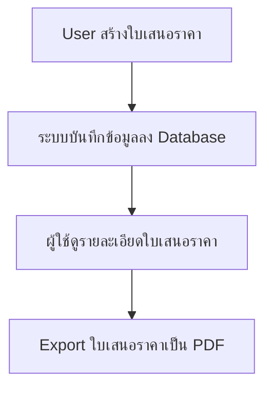

# Req :: ระบบจัดการใบเสนอราคา

## List of features
* User ทำการสร้างใบเสนอราคา
* User ทำการดู list ใบเสนอราคา
* User สามารถ export ใบเสนอราคาในรูปแบบ PDF

## User flows
1. User เข้ามาทำการสร้างใบเสนอราคา
2. ระบบทำการบันทึกข้อมูลลง database
3. ดูรายละเอียดของใบเสนอราคา
4. ทำการ export เป็น PDF

## Technologies
* Nodejs
* Web framework with [expressjs](https://expressjs.com/)
* Database with sqlite

